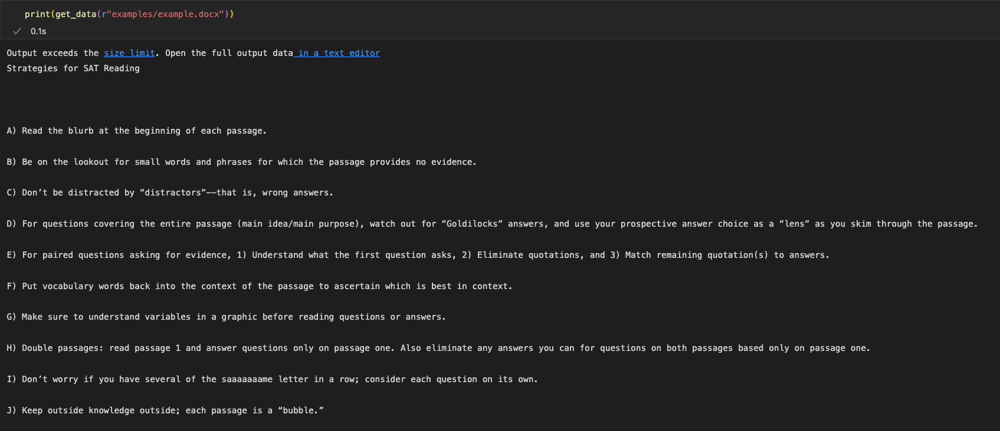
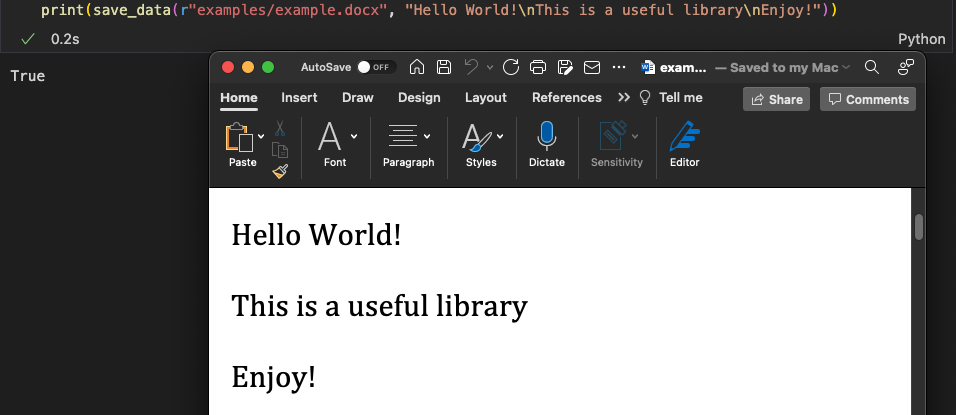

[homepage](index.md) | [scraper functions](scraper.md)
# Files Modules

The functions from dputils.files can be used to get and save data into txt, doc(x), pdf files and more

Functions from dputils.files:
1. get_data: 
    - To import, use statement: 
        ```python3
        from dputils.files import get_data
        ``` 
    - Obtains data from files of any extension given as args(supports text files, binary files, pdf, doc for now, more coming!)
    - sample call:
        ```python3
        content = get_data(r"sample.docx")
        print(content)
        ```
    - sample output:
      
    - Returns a string or binary data depending on the output arg
    - images will not be extracted
    
    
2. save_data:
    - To import, use statement:
         ```python3
        from dputils.files import save_data
        ```
    - save_data can be used to write and save data into a file of valid   extension.
    - sample call: 
         ```python3
        pdfContent = save_data("sample.pdf", "Sample text to insert")
        print(pdfContent)
        ```
    - sample output:
      
    - Returns True if file is successfully accessed and modified. Otherwise False.
