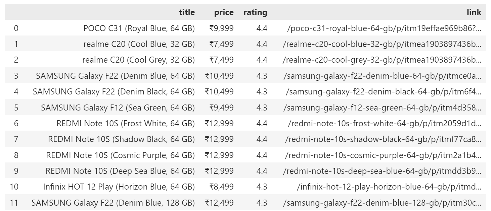

A python library which can be used to extraxct data from files, pdfs, doc(x) files, as well as save data into these files. This library can be used to scrape and extract webpage data from websites as well.

# Files Modules

Functions from dputils.files:
1. get_data: 
    - To import, use statement: 
        ```python3
        from dputils.files import get_data
        ``` 
    - Obtains data from files of any extension given as args(supports text files, binary files, pdf, doc for now, more coming!)
    - sample call:
        ```python3
        content = get_data(r"sample.docx")
        print(content)
        ```
    - Returns a string or binary data depending on the output arg

2. save_data:
    - To import, use statement:
         ```python3
        from dputils.files import save_data
        ```
    - save_data can be used to write and save data into a file of valid   extension.
    - sample call: 
         ```python3
        pdfContent = save_data("sample.pdf", "Sample text to insert")
        print(pdfContent)
        ```
    - Returns True if file is successfully accessed and modified. Otherwise False.

# Scrape Modules
Functions from dputils.scrape:
1. get_webpage_data:
    - To import, use statement: 
         ```python3
        from dputils.scrape import get_webpage_data
        ```
    - get_webpage_data can be used to obtain data from any website in the   form of BeautifulSoup object
    - sample call: 
        ```python3
        soup = get_webpage_data("https://en.wikipedia.org/wiki/Hurricane_Leslie_(2018)")
        print(type(soup))
        ```
    - Returns data as a BeautifulSoup object

2. extract_one:
    - extract_one can be used to extract a data item as a dict from data in a given BeautifulSoup object
    - To import, use statement: 
        ```python3
        from dputils.scrape import extract_one
        ```
    - usage: 
        ```python3
        soup = get_webpage_data("https://en.wikipedia.org/wiki/Hurricane_Leslie_(2018)")

        dataDict = extract_one(soup, title = {'tag' : 'h1', 'attrs' : {'id' : 'firstHeading'}, 'output' : 'text'})
        print(dataDict)
        ```
    - Output will be of type dict

    ## Example:
    ```python3
    example here
    ```
3. extract_many:

    ## Example:
    import the functions
    ```python3
    from dputils.scrape import extract_many, get_webpage_data
    ```
    grap your soup
    ```python3
    url = "https://www.flipkart.com/search?q=mobiles&otracker=search&otracker1=search&marketplace=FLIPKART&as-show=on&as=off"
    soup = get_webpage_data(url)
    ```
    Provide all the parameters in the dict as shown in the example below.
    ```python3
    target = {
    'tag': 'div',
    'attrs':{'class':'_1YokD2 _3Mn1Gg'}
    }
    items = {
        'tag': 'div',
        'attrs':{'class':'_1AtVbE col-12-12'}
    }
    title = {
        'tag': 'div',
        'attrs':{'class':'_4rR01T'}
    }
    price = {
        'tag': 'div',
        'attrs':{'class':'_30jeq3 _1_WHN1'}
    }
    rating = {
        'tag': 'div',
        'attrs':{'class':'_3LWZlK'}
    }
    link = {
        'tag': 'a',
        'attrs':{'class':'_1fQZEK'},
        'output':'href'
    }
    ```
    call the functions with correct names
    - **soup** : from get_webpage_data() function
    - **target**: the subsection where the contents are present (optional)
    - **items** : the repeating HTML code the contains the items (required)
    - others will be the names and dicts of items to be extracted just link in extract one
    ```python3
    out= extract_many_1(soup, target=target, items=items, title=title, price=price, rating=rating, link=link)
    ```
    - Output will be a list of dicts
    ```python3
    print(out)
    ```
    (optional) Convert the data into pandas dataframe
    ```python3
    import pandas as pd
    df = pd.DataFrame(out)
    print(df)
    ```
    

4. extract_urls
    - extract_urls can be used to extract all urls as a list from data in a given BeautifulSoup object
    - To import, use statement: 
        ```python3
        from dputils.scrape import extract_urls
        ```
    - usage: 
        ```python3
        soup = get_webpage_data("https://en.wikipedia.org/wiki/Hurricane_Leslie_(2018)")

        urlList = extract_urls(soup, target = {'tag' : 'div', 'attrs' : {'class':'s-matching-dir sg-col-16-of-20 sg-col sg-col-8-of-12 sg-col-12-of-16'}})
        print(urlList)
        ```
    - Output will be list of urls
    
These functions can used on python versions 3.8 or greater.

References for more help: https://github.com/digipodium/dputils

Thank you for using dputils!